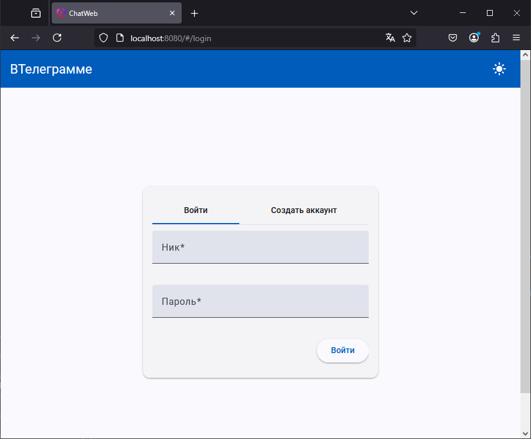
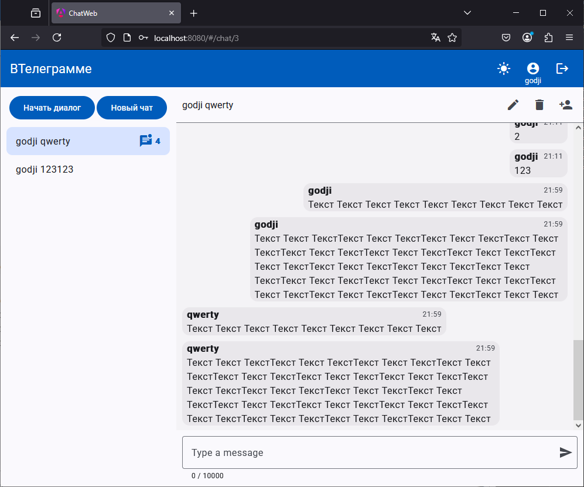

# Проект Chat Messenger

Проект включает два компонента: бэкенд на Spring и фронтенд на Angular. Описание двух подходов для сборки.

## 1. Только API

### Сборка с Gradle

1. Клонируйте репозиторий:
   ```bash
   git clone https://github.com/yxngxr1/chat.git
   cd chat
   
2. Настройте .env файл окружения по образцу .env.example

3. Соберите и запустите проект:
   ```bash
   ./gradlew build
   java -jar .\build\libs\chat-0.0.1-SNAPSHOT.jar
   ```

### Сборка с Maven
1. Клонируйте репозиторий:
   ```bash
   git clone https://github.com/yxngxr1/chat.git
   cd chat

2. Настройте .env файл окружения по образцу .env.example

3. Соберите и запустите проект:
   ```bash
   mvn clean install
   mvn spring-boot:run
   ```
   или
   ```bash
   ./mvnw clean install
   ./mvnw spring-boot:run
   ```
#### После выполнения этих шагов API будет доступно на локальном сервере по умолчанию (http://localhost:8080).
#### Посмотреть спецификацию openapi можно по http://localhost:8080/swagger-ui/index.html

## 2. Api с выдачей клиентского web интерфейса (статики)

1. Создайте общую директорию для сборки
   ```bash
   mkdir chat
   cd chat

2. Клонируйте репозитории:
   ```bash
   git clone https://github.com/yxngxr1/chat.git
   git clone https://github.com/yxngxr1/chat-web.git

3. Установить конфигурационные файлы для maven
   ```bash
   cp ./chat/maven-build-instruction/pom.xml ./
   cp ./chat/maven-build-instruction/back/pom.xml ./chat/
   cp ./chat/maven-build-instruction/front/pom.xml ./chat-web/
   cp ./chat/.env.example ./

4. Настройте .env файл окружения по образцу .env.example в ./ и в ./chat

5. Соберите и запустите проект
   ```bash
   mvn clean install
   java -jar .\chat\target\chat-backend-0.0.1-SNAPSHOT.jar

#### После выполнения этих шагов API с выдачей web (spa) приложения будет доступен на локальном сервере по умолчанию (http://localhost:8080).

